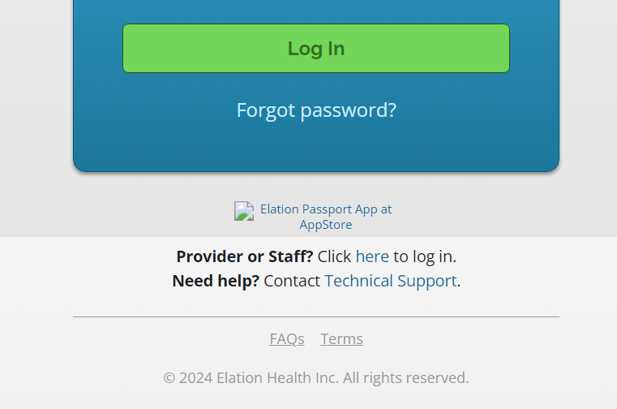

# 2024-06-12 Elation

Hi Mike

Thank you for your email. I hope we can begin to discuss ways in which Pine Park Health can improve its digital dialog with patients with patients in order to improve patient outcomes.

A good place to start is with the Elation Portal. I have already mentioned the continued appearance of the Apple ad when logging on a Windows, Linus or Android device.

I would also like to bring the following screen shot to your attention.

You will note that the link to some Apple icon is broken. This is not a good look for a health care provider.

Nonetheless, since I was told to go the the Apple Store, I did so. I was surprised by the low rating of 2.2 out of 5. This is not a good look for a health care provider.

Then I went to the Elation Passport website, to look for an Android version. I could not find one. This is not a good look for a health care provider.

Can I access Patient Passport from my phone or tablet? The answer is "...an Android app is not available at this time." The interesting thing is that there has been an Iphone app since 2019.

There are a number of other issues we van discuss, but for now the broken link, the very low Apple Store rating and the lack of an Android app are a starting point. These are issues that Pine Park Health would better serve patients by seeking answers to these issues from Elation.

## Broken image link to image

https://itunes.apple.com/us/app/elation-passport-for-patients/id1264836684?mt=8

## Low ratings ~ 2.2 out of 5

https://apps.apple.com/us/app/elation-passport-for-patients/id1264836684

## No Android version

* iPhone version since 2019

## Website

* No Spanish version
* No way to enlarge the print or make ARIA compatible
* No way to request prescription refill
* No list of upcoming immunizations or other reminders
* No learning library
* No two-step verification
* No way to look at reports from other lealth care providers

## Access

* No way to add a family or caregiver Access

## Messages

* No way of forwarding a message
* No way of copying message to a relative or other caregiver
* No built-in way of printing a message ~ must download PDF then print
* No way to bookmark, search, or filter messages
* No way to move a message to trash or archive

## Message Composition

* No way of editing the message subject
* No way of formatting the body of the message ~ bold, italic or links etc
* No way of saving a draft message

