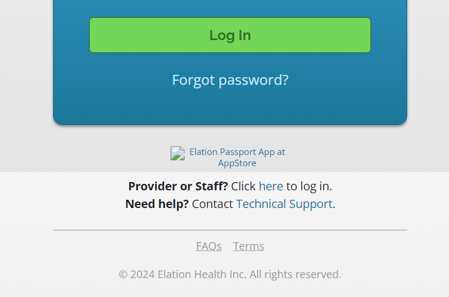

# 2024-06-12 Elation

## Broken image link to image

https://itunes.apple.com/us/app/elation-passport-for-patients/id1264836684?mt=8

## Low ratings ~ 2.2 out of 5

https://apps.apple.com/us/app/elation-passport-for-patients/id1264836684

## No Android version

* iPhone version since 2019

## Website

* No Spanish version
* No way to enlarge the print or make ARIA compatible
* No way to request prescription refill
* No list of upcoming immunizations or other reminders
* No learning library
* No two-step verification
* No way to look at reports from other lealth care providers

## Access

* No way to add a family or caregiver Access

## Messages

* No way of forwarding a message
* No way of copying message to a relative or other caregiver
* No built-in way of printing a message ~ must download PDF then print
* No way to bookmark, search, or filter messages
* No way to move a message to trash or archive

## Message Composition

* No way of editing the message subject
* No way of formatting the body of the message ~ bold, italic or links etc
* No way of saving a draft message

