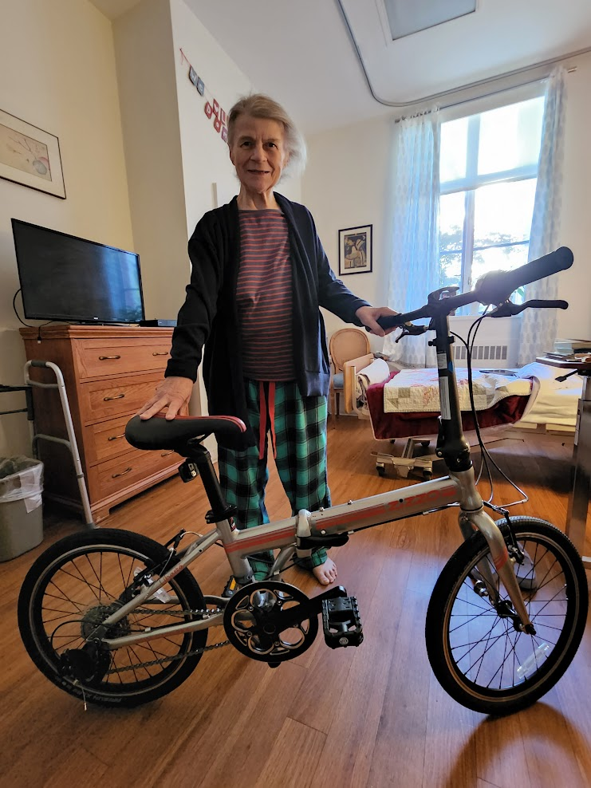

# Dominique Gaspar

tags #heritage #friend #resident #bikes #hospice

## zizzo

* https://zizzo.bike/collections/accessories
* https://zizzo.bike/collections/refurbished

Phone: +1 (866) 788-2202
Email: SUPPORT@ZiZZO.BIKE

* https://en.wikipedia.org/wiki/Hospice
* https://en.wikipedia.org/wiki/Hospice_care_in_the_United_States

## Pedro

https://fittedbypedro.com/

## 2022-05-20

My friend Dominique lives in the Health Center here at the Heritage on the Marina. The Health Center is the area for people that require round-the-clock registered nurses in attendance. A while ago Dominique went into [hospice care]( https://en.wikipedia.org/wiki/Hospice) because her cancer has progressed.

Ever since I met Dominique at the beginning of 2022, I have stopped by her room for a chat after breakfast every day or too. I do this because we have a very lively repartee. She is younger than I am, is up to date on current events and is always online.

In her former life Dominique worked at the Warming Hut on [Crissy Field]( https://www.parksconservancy.org/services/warming-hut-park-store ). It was her favorite job. The icing on the cake: she could commute by bicycle. I know this because Dominique is happy to talk "bicycle" at the drop of a hat - routes, bike styles, king issues - anything goes.

More to the point at hand. Dominique quite often became lost in thought over the bike of her dreams - a light weight folding bicycle offered by a manufactured in nearby Union City CA.

To make a long story short, I ordered the bicycle and it arrived on Wednesday. I assembled it and took it down to her room on Wednesday. Here is a photo of Dominique with "Libby" - her refurbished [ZiZZO Liberté]( https://zizzo.bike/products/zizzo-folding-bike-liberte ) folding bicycle.

I have asked Dominique not to get on Libby. She understands that in her present condition this would pose many risks. Even so we are having fun imagining where Libby would like to go, if she is happy and - if somebody comes into the room - will Libby bark? Libby is developing a personality. Fingers crossed, she becomes a companion for Dominique.

I do not know if I did the right thing. I am no expert in end-of life care. But can there be much wrong with helping making a dream come true?

## 2022-05-14

Dominique:

Recap of our good observation
When you tell somebody about something bad in your life - such as an accident or a death - and they go all sad, gushy and whatever, then they are putting you in the position of having to console them about your issue.

Fitted by Pedro

If we need help:

* https://fittedbypedro.com/

Bike Permissions from Heritage

I will ask for permission to bring in a bike from Katrina and Michael the head nurse. I will inform that that the purpose of the bike is simply to assist with provoking joyous thoughts. I will also state that you will not attempt to mount the bicycle without another person in your room.

Does that sound OK?

Bike Permissions from Sisters

I assume you will inform them or surprise them or whatever. ;-)

Bike Preferences

I will phone Zizzo on Monday - when they are likely to be less busy than on the weekend. I will ask about refurbished bikes in the $300+ price range.

Question 1: what is more important for you the model type or the color red?

Question 2: Is it OK if a refurbished bike has a scratch or two?

