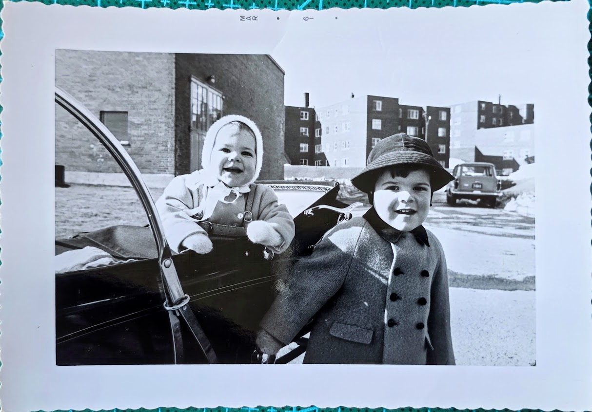
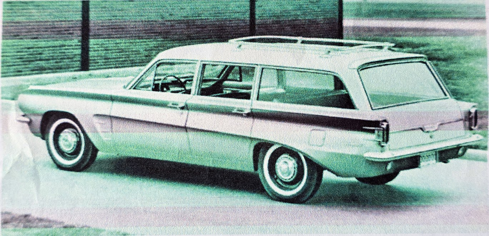

# Toronto to San Francisco, 1962

**Snowstorms, Stetsons, and Sunsets**

*By Jane Standing*

***

_The American Dream is the belief that anyone, regardless of their background, can achieve success and upward mobility through hard work and determination in the United States. An oft-repeated and essential part of this narrative, is that special and particular journey to the destination where the Dream comes true._

_Jane's telling of her journey is complete in itself. We have no need to enquire further. From her writing - observant, engaged and lively - we know that Jane's American Dream will come true._

***

This is how we came to America.

We’d been living in Toronto, enduring the intense cold of winter and sweltering summers which we didn’t care for. When our children came along, it felt even harder. A friend of my husband’s who’d travelled to the States, told us, “There’s only one place to go: San Francisco.” I’d studied America in high school. San Francisco with streets so steep they needed cable cars, the Great Lakes, and the coal fields of Pennsylvania.

At the time we set out on our journey, the children were ages 3 and 21 months. My English Mother would be joining us as well.

We sold or gave away nearly everything. Even the cot where Sarah slept was bought from under her one Sunday afternoon. She spent her last nights in Toronto in a playpen. We’d been advised to bring only the small stuff to make us feel at home.

After much preparation, we were set to leave but hit a snag. My mother needed her birth certificate from London and the wheels were grinding slowly. The poor darling waited two hours at Toronto City Hall, nearly freezing to death before we arrived to pick her up.

We drove to Sarnia, southwest Ontario, in our green ‘53 Pontiac to stay with friends we'd met coming on the boat from England a few years before. We hadn’t reached the States yet but our car had almost given up so Barry and I crossed into Port Huron, returning with a new silvery-blue Pontiac Tempest. We had no address or jobs, and we wanted the car financed. The salesman looked doubtful but came back smiling and said, “You’ve got your car.”

We crossed into the US. in a snowstorm and set off for Chicago. Even the inclement weather and our daughter’s cold didn’t stop us. We were determined to get to San Francisco.

On 2/22/1962 we had our papers inspected and stamped at Port Huron and we immigrated into the US. America was exciting and a little intimidating, but we were together as a family and that’s all that mattered.

My husband Barry was the only driver and I sat next to him with maps and snacks. Mom sat in the back with our cooler, while the children played and napped in the far back of the station wagon. There were no seatbelts or kid’s car seats back then. That night, we stopped at a motel on the outskirts of Chicago. Barry and I ventured out for pizza in a complete whiteout. Thankfully, we made it back alive with dinner in hand for the family.

The next morning, on our way to Tulsa, we caught brilliant sunshine and blue sky. We drove on Route 66, heading south to avoid snow. We passed through St Louis along the river as they were building the iconic Gateway Arch.

Tulsa was sunny and warm and we reveled in it. At a motel that evening, the manager recommended a private house that served excellent veal. We opened the door and were greeted by seven men in Stetson hats. They stared at us as if we’d come from the moon. We had a lovely evening and the veal was as delicious as they’d said.

We set off again, this time for Albuquerque. We drove west across the top of Texas, stopping for our first Golden Arches hamburger. The landscape was rocky with little vegetation, and we passed by what appeared to be a petrified forest.

My mother, a very English lady, was taking this all in her stride. She’d hardly had time to absorb the culture of Toronto, now here she was on a wild goose chase to California.

Albuquerque was different from anything we’d experienced before. People spoke Spanish and the food was quite different. In the evenings, the sunsets turned the mountains all pink and purple.

Flagstaff surprised us with snow, and as we passed Death Valley, we saw signs warning drivers not to pass in summer, which seemed funny as winter there was lovely and temperate.

At last, we crossed into California with its green hills rolling out like folding velvet. We stopped for ice cream in Barstow, then made our final push though a series of sleepy towns, spending our last night in Salinas so we’d be fresh the next morning for our drive into San Francisco.

As entered the city the following morning, San Francisco sparkled white under a brilliant blue sky. There were no high rises then, just the Ferry Building and Coit Tower, standing prominent against the landscape. We found our motel in the Marina at the end of Lombard Street, with painted bougainvillea over its doors.

We'd made it. Barry & I, our young children, and my Mother — all of us together in this magnificent city. Our new home.

***

Claude AI has this to say:

Here are three particularly interesting aspects of Jane's story:

**1. The remarkable car financing story** - Despite having no address or jobs in America, Jane and Barry managed to get financing for a new Pontiac Tempest after their old car nearly gave up. They simply crossed from Sarnia into Port Huron, and somehow convinced a car salesman to finance their purchase. The salesman initially "looked doubtful but came back smiling" - a testament to either their persuasiveness or the more trusting business culture of 1962.

**2. The timing of their journey through American history** - They traveled in February 1962 and witnessed America at a fascinating moment. They drove past St. Louis while the iconic Gateway Arch was still under construction, had their first McDonald's experience (described as "Golden Arches hamburger"), and arrived in a San Francisco that had "no high rises then, just the Ferry Building and Coit Tower." They were literally driving through an America that was transforming.

**3. The memorable encounter in Tulsa** - When they went to a recommended private house for dinner, they opened the door to find "seven men in Stetson hats" who "stared at us as if we'd come from the moon." This perfectly captures the cultural clash of an English-Canadian family with young children suddenly finding themselves in the heart of cowboy country - yet they ended up having "a lovely evening" with excellent veal, showing how initial strangeness often gave way to American hospitality.
