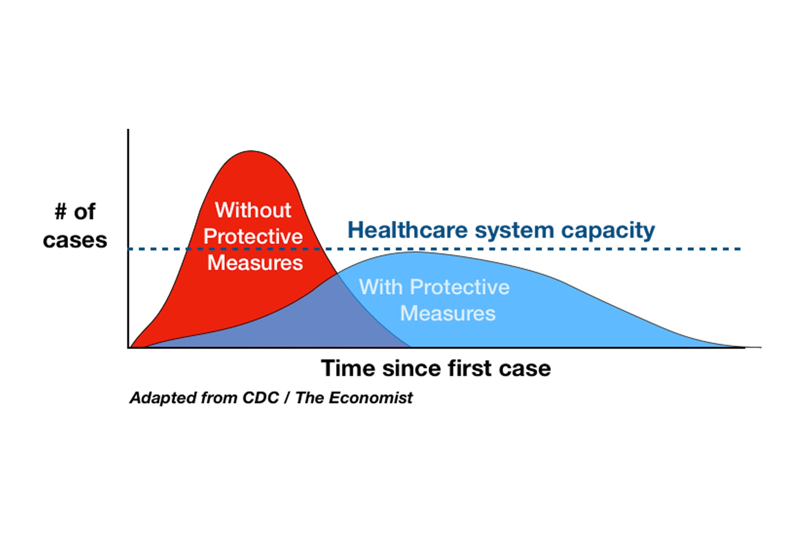

# Tracking the daily spread of COVID-19

Questions I want to try and respond to include the following

* How concerned should you be - given where you happen to be on any given day?
* What are helpful types of statistics to look for
* Where can you access timely, authoritative statistics?

## Level of concern

If there are no cases of COVID-19 for a radius of hundred miles of where you are currently then you probably do not need to self quarantine yourself. If there have been cases reported in your neighborhood, then prepare well.

There is large dark area in between these extremes where it is not easy to decide what to do.

A good response is to invoke the [Serenity Prayer]( https://en.wikipedia.org/wiki/Serenity_Prayer ).

God, grant me the serenity to accept the things I cannot change,
Courage to change the things I can,
And wisdom to know the difference.

The idea is this: in a location where there are no numbers or you do not know the numbers, you are not in control and therefore going about your daily business as normal is a good course of action.

## Your responsibility

If there are cases in your locale then you must do your best to help:slow the spread

[Flattening the Coronavirus Curve]( https://www.nytimes.com/2020/03/11/science/coronavirus-curve-mitigation-infection.html )

> Mitigation efforts like social distancing help reduce the disease caseload on any given date, and can keep the healthcare system from becoming overwhelmed.Credit...Drew Harris

## Statistics to look for

The most frequently displayed statistics these days is the total number of confirmed cases. This is the number that appears most frequently in the headlines and it's use is a way of maintaining reader engagement.

This number, is of little use in helping you determine if you are at risk in your neighborhood today.

A much more useful number is the number of new cases confirmed in the past 24 hours in your locale.

If the number is significant, then you must take action. In order to see if action is necessary, you need to check the number of new cases every day.

It turns out that locating these numbers is tricky. Helping you get the numbers quickly and somewhat easily is the objective of this post.

## [Coronavirus COVID-19 Global Cases by the Center for Systems Science and Engineering (CSSE) at Johns Hopkins University (JHU)]( https://gisanddata.maps.arcgis.com/apps/opsdashboard/index.html#/bda7594740fd40299423467b48e9ecf6 )

_The above title amd image are a clickable links to the chart_

The chart is provided by [Johns Hopkins University]( https://en.wikipedia.org/wiki/Johns_Hopkins_University )

Wikipedia says "The university has been ranked by numerous major education publications as among the top universities in the world."

The chart is updated several times a day from a number of sources around the world. The [source code]( https://github.com/CSSEGISandData/COVID-19 ) for the chart is available on GitHub.

There are many similar charts on the web - a number of which build upon th JHU database, but I consider the JHU chart to be the most timely, authoritative and relevant chart of Covid-19 that I have come across thus far.

There are two sections of the chart worthy of checking frequently.

In the chart at lower right corner, there are three tabs. The tab labeled "Daily Cases" is on great interest

This chart shows a timeline of the number of new confirmed cases around the world on a daily basis. On days where it rises little or falls you can be happy an it rises a lot, It's OK to be sad.  Looking at this chart you can see the rise and decline of cases in China and then follow the rise of cases outside of China.

The issue about this chart is that it depicts a global statistic. It does not really help you determine the current risk where you live.

The second area of interest is the map in the middle. You can click on a circle in the map to see more detail

## [COVID-19 Surveillance Dashboard]( http://nssac.bii.virginia.edu/covid-19/dashboard/ )

_The above title amd image are a clickable links to the chart_

A Covid-19 map from UVA offers similar numbers. It also is update several times during the day

If you click the word "Cumulative" you switch to the "Daily" tab which looks like this

I use this chart to compare and verify the data alongside the Johns Hopkins site.

The map section is also of interest. Zoom in and click on a locale and you will see statistics that are more detailed than the Johns Hopkins numbers

The box that appears is of great interest. It provides data down to a city level. So, for example, in the screen capture you can see the number of cases in San Francisco is 14. I can feel OK about this number because it has not changed for several days. If and when this number increases significantly then I will given verifiable notice of a definite call to action.

## _New York Times_ [U.S. Coronavirus Cases: Full Map]( https://www.nytimes.com/interactive/2020/us/coronavirus-us-cases.html )

The diagram of great interest on this page is titled "New coronavirus cases announced in the U.S. each day" and is about a third of the way down the page.

## World Health Organization [ Coronavirus disease (COVID-2019) situation reports ]( https://www.who.int/emergencies/diseases/novel-coronavirus-2019/situation-reports)

The WHO provides daily situation reports as PDF files. They the "official" record of the pandemic. The section titled "Surveillance" provides detailed numbers for daily new confirmed cases country by country. You can open Multiple reports to compare the daily new case rate. The data tends to be a day behind the other charts. The charts from The Base Lab (See below) may offer a faster view of thus data

## More

### MIT _Technology Review_[The best, and the worst, of the coronavirus dashboards]( https://www.technologyreview.com/s/615330/best-worst-coronavirus-dashboards/ )

> There are dozens of sites that show you how coronavirus is spreading around the world. Here is our ranking.

### The Base Lab [COVID-19_virus]( https://coronavirus.thebaselab.com/ )

The statistics here are some of the best, but I'm still low on the learning curve on this complex site

