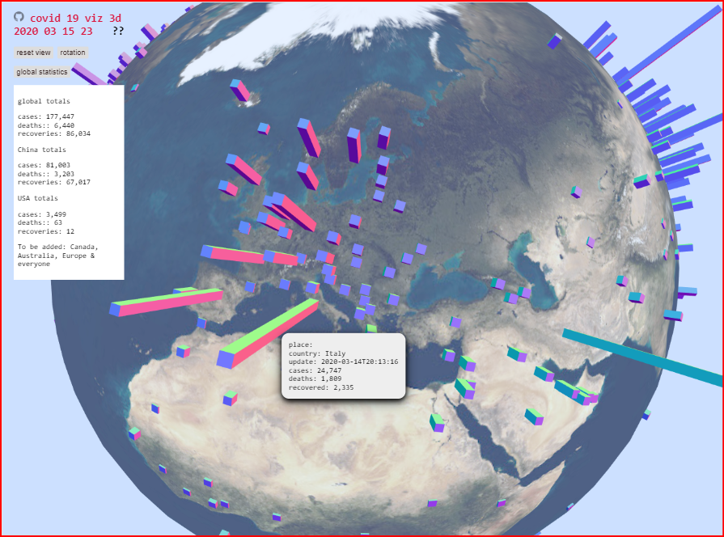

# 2020-03-16 ~ Day #3 ~ Learn before you earn ~ Practice the self-quarantine

Today was all about building the "Spider COVID-19 Viz 3D" app

The concept of the app is to show you the current COVID-19 situation around the entire world in 3 seconds or less.

* View the data from John Hopkins University [GitHub repository]( https://github.com/CSSEGISandData/COVID-19/tree/master/csse_covid_19_data ) in 3D
* Provide entry-level programming code anybody can copy and make better
* Display all the data in seconds on any device then zoom and rotate and click to see the cases in 3D

The progress made in one day was excellent - as you can see above. And there's a lot more features that can be added. For example, why are those blue bars so boring-looking? Or can you show me the borders of the countries?

In all the other aspect, the day went quite well. Apart from a ton of banging on the keyboard, I did the following:

* Shower and get dressed
* Cook a meal - microwaved a frozen veggie dish with added shredded chicken, curry powder, olive oil and harissa
* Walk 1.2 miles ~ walking down my 100 yard hall after 11pm when no one was looking
* Ride 10 minutes on my exercise bike
* Message, email and talk with peeps around the world

During the day, I opened the door and spoke to three people - but made certain they stood two meters away.

When I did my walk down the hall, I made sure the fire escape door was open a bit in order to create a breeze.

I would have liked to go out on the balcony to catch some vitamin D but the Sun never came out

I hate my exercise bike. It's ugly and riding is so boring. Until now. What I've been doing is riding it in one minute sprints. From time to time, I just get up from my desk, walk a few steps, ride a bit, go back to my desk and continue what I was doing. The short sprints do not really interrupt my train of thought - and may actually provide fresh thoughts.

So what is next?

Well, all the basic technical bits on the COVID-13 Viz 3D app are in place, so now we need to make it jump and dance a bit. Suppose we deleted all the oceans. Then we see the under sides of each country and there could be bars showing different numbers **underneath** each country. For example, heh heh, These bars could show estimates as to how much evidence is being buried. We shall see.

In terms of food, I have enough to last me the rest of the seven days. My house cleaners are coming tomorrow and I will let them clean and do the laundry. So it goes. After all, this is a practice quarantine.

And the lesson learned is that for once it is OK to be a night owl. I can do my walks and take out the garbage knowing that there's nobody else in the hall.

The scary thing is the elevator. I live on the 21st floor. Riding up all those floors in a tiny badly ventilated space with half a dozen breathing, wheezing bodies is not ideal.

